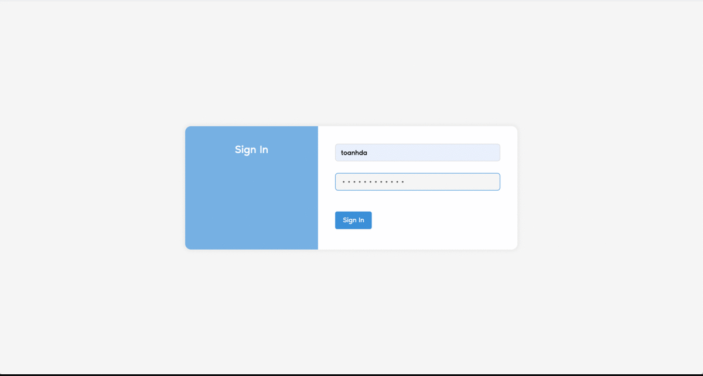

Dojo
=== 
    

- [Dojo](#dojo)
  - [1. Introduction](#1-introduction)
  - [2. Brief UIs](#2-brief-uis)
  - [3. Requirements](#3-requirements)
  - [4. Functional](#4-functional)
  - [5. How to run](#5-how-to-run)
  - [6. Authors](#6-authors)
  - [7. Versioning](#7-versioning)
  - [8. License](#8-license)
  - [9. Acknowledgments](#9-acknowledgments)

## 1. Introduction

Dojo is application support campaign fresher interview 2020.

## 2. Brief UIs



## 3. Requirements

* Node 8 or later version

## 4. Functional

- Authenticate and authorization
- Interview question
  - Import question
  - Show question
- Management user
- Responsive on multiple devices such as: laptop, ipad, iphone X...
## 5. How to run

- Build server

```java
$ cd server
$ npm install
$ npm start
```

- Build client

```java
$ cd client
$ npm install
$ npm start
```


## 6. Authors

* **Toan HUYNH** - *VNG Employee*

## 7. Versioning

- The versioning scheme we use is SemVer.


## 8. License

This project is licensed under the [MIT License](./LICENSE.md)

## 9. Acknowledgments

* Mr Anh LE - Principal Software Engineer at VNG - for made clear requirements, review code and feedback.
* Mr Anh NGUYEN - 	Associate Software Engineer at VNG - for design logo